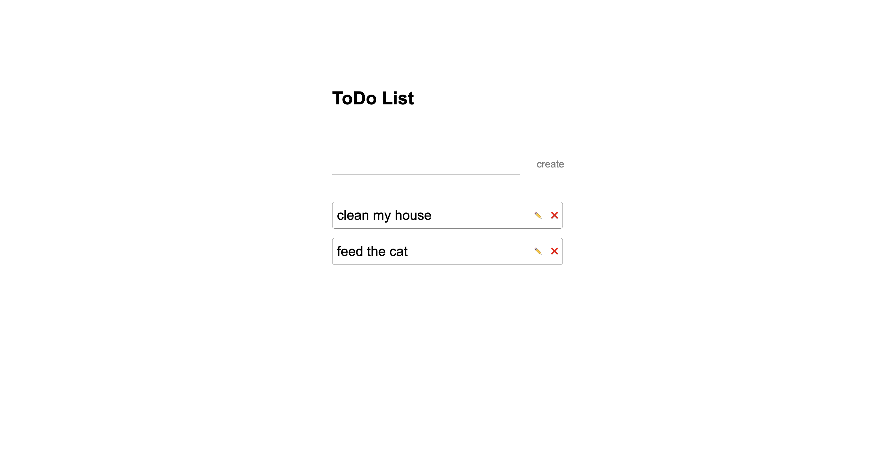

# ToDo List

> A simple to do list with `create`, `edit` and `delete` functionalities.

## Table of contents

- [ToDo List](#todo-list)
  - [Table of contents](#table-of-contents)
  - [General info](#general-info)
  - [Screenshots](#screenshots)
  - [Technologies](#technologies)
  - [Setup](#setup)
  - [Code Examples](#code-examples)
  - [Status](#status)

## General info

> The objective of the project is to practice separation of concerns in
> JavaScript and use `setInterval` and `clearInterval` APIs.

## Screenshots



## Technologies

- JavaScript
- HTML5
- CSS3
- VS Code

## Setup

Clone the repo and run npm install.

## Code Examples

```js
// created to do
button.addEventListener('click', () => {
  if (input.value === '') {
    return;
  } else {
    data.push(input.value);
    updateList();
    input.value = '';
    return;
  }
});
```

## Status

Project is: _done_
